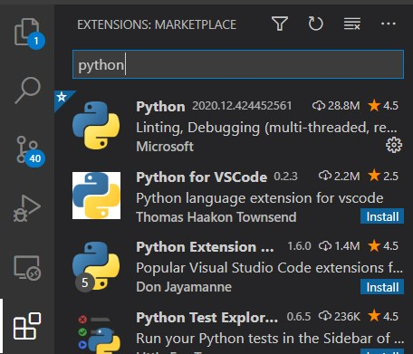
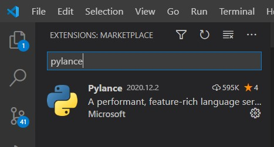
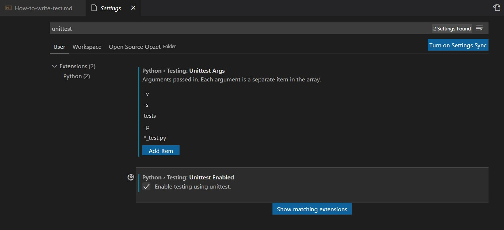
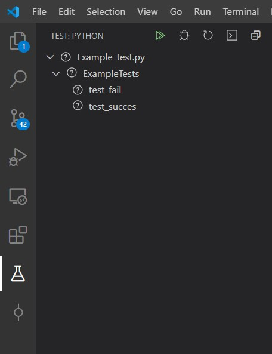
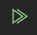
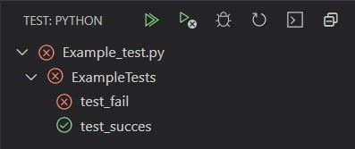
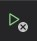

# Unittesting
- [Unittesting](#unittesting)
  - [Test location and file names](#test-location-and-file-names)
  - [Writing a test](#writing-a-test)
    - [Test must haves](#test-must-haves)
  - [Best practice](#best-practice)
    - [KISS (Keep it simple, stupid)](#kiss-keep-it-simple-stupid)
    - [Keep it atomic](#keep-it-atomic)
    - [Independency](#independency)
    - [Be Descriptive](#be-descriptive)
    - [In-depth testing](#in-depth-testing)
    - [provide static assets](#provide-static-assets)
    - [Consistant input](#consistant-input)
  - [Running tests...](#running-tests)
    - [On the commandline](#on-the-commandline)
    - [In Visual Studio Code](#in-visual-studio-code)
  - [Viewing test results...](#viewing-test-results)
    - [On the commandline](#on-the-commandline-1)
    - [In Visual Studio Code](#in-visual-studio-code-1)

## Test location and file names
We'll use the unittesting framework shipped with python, called unittest
for this reason we'll also use the unittest naming conventions,
all tests need to be placed in the folder called `tests`, this folder will be placed in the root level of the repo.  

Every test name must follow the following format -> `*_test.py`, e.g. `example_test.py` or `main_test.py`  
thisway the unittest.discover method will detect all the tests correct.

## Writing a test
To write a basis test you're welcome to use the following template
```py
import unittest
class YourTestClass(unittest.TestCase):
    """This is a example testcase""" # a short description about the test cases, what focus does it provide(perfomance tests | accuracy tests | basic functionality tests)
    
    def test_succesfull_1(self): 
        """This test will succeed""" # what will this test, well test
        self.assertEqual(True, True)
    
    def test_succesfull_2(self):
        """This test will also succeed"""
        self.assertEqual(int(True), 1)
    
    def test_more_then_one(self):
        """multi-line
        docstring
        for
        multiple
        tests
        """
        self.assertEqual(int(True), 1)
        self.assertEqual(int(True), 1)
        self.assertEqual(int(True), 1)
if __name__ == "__main__":
    unittest.main()
```
or have a look at the [example test](tests/Example_test.py)
### Test must haves
- every test-file should be places in the `tests` folder
- every test-file should end with `_test.py`, like `camera_test.py` 
- every test-class should be a `unittest.TestCase` sub-class.(like in the example)
- every test-function should start with `test_`, unittest will detect what functions to run and what not to

## Best practice
<!-- https://stackify.com/unit-testing-basics-best-practices/ -->
<!-- https://docs.microsoft.com/en-us/dotnet/core/testing/unit-testing-best-practices -->
<!-- https://riptutorial.com/unit-testing/topic/6074/unit-testing--best-practices -->
<!-- https://www.parasoft.com/unit-testing-best-practices-getting-the-most-out-of-your-test-automation -->
> "By focusing on writing only the code necessary to pass tests, designs can often be cleaner and clearer than is achieved by other methods." - *In Test-Driven Development by Example, Kent Beck*
### KISS (Keep it simple, stupid)
Test small functions like addition, or a single functions
### Keep it atomic
a single test should test a single function, if you want to test addition
write (for example) 9 different tests (if you have to)
- positive number + positive number
- positive number + zero
- positive number + negative number
- zero + positive number
- zero + zero
- zero + negative number
- negative number + positive number
- negative number + zero
- negative number + negative number  
now you'll have a clear result of which test succeeded and which failed.
### Independency
every test should be able to run independant from other tests,  
if a test needs a variable from another test, make sure the test will be able to succed without the other test being run. 
You could either fix this by
- declaring a global set up (variables used by the whole file)
- declaring a local setup (setup all the variables in the function)
> NOTE: variables used in a global set up shouldn't be changed throught tests, for this copy them and then use them
> NOTE: performance wise it's better to create a global set up, but independant wise it's better to create local setup
### Be Descriptive
a test name should tell someone what it tests, for example
- test_addition_positive_numbers ✅
- test_KNN_model_prediction_accuracy ✅
- test_addition ❌
- test_Camera ❌
and if the name is to long, use the docstring. this could be a multi-line docstring if needed.
### In-depth testing
a test should handle all the possible cases. so if you think the code could fail on something, make sure you right a test for it.
and also like in the example of [keep it atomic](#keep-it-atomic), test every case. you'll only have to write them once, and they will work forever
### provide static assets
If you want to proof some function provide necessary assets in the `assets` folder inside the `tests` folder
### Consistant input
If you want to create a test with random input, generate the random input once and store it. this will increase the performance and stability of the test

## Running tests...
### On the commandline
All tests could be run by using this command `python3 -m unittest discover -s "./tests" -p "*_test.py"`, in the root folder of the project
### In Visual Studio Code
Visual Studio Code supports python unittesting, this can be done by installing the python and Pylance extentions  
  
  
go to your settings `Ctrl + ,` or `File -> Preference -> Settings` and search for unittest and check the use unittest box, and configure the parameters.

This will add the following icon to you sidebar  
  
this will automtically show you all the availible testfiles, classes and individual tests. these can be run all at once by clicking on 

## Viewing test results...
### On the commandline
the result on the command line should look like this
```bash
F. # ---> status of test '.' means succes, 'F' means Failed
======================================================================
FAIL: test_fail (Example_test.ExampleTests) # ---> testname (filename.classname)
This test will fail # ---> docstring of the test which failed 
----------------------------------------------------------------------
Traceback (most recent call last):
  File "./tests/Example_test.py", line 16, in test_fail # ---> file and line number
    self.assertEqual(True, False) # ---> the assertion test it failed on
AssertionError: True != False # ---> reason why the test failed
----------------------------------------------------------------------
Ran 2 tests in 0.001s # ---> number of tests ran and time elapsed
FAILED (failures=1) # ---> amount of tests failed, incase of zero failed tests 'OK'
```  
when all tests are succesfull the result will look like  
```bash
. # ---> status of test '.' means succes, 'F' means Failed
----------------------------------------------------------------------
Ran 1 test in 0.000s # ---> number of tests ran and time elapsed
OK # ---> amount of tests failed, incase of zero failed tests 'OK'
```
### In Visual Studio Code
In Visual Studio Code once the tests are executed, the result will be show in the test view 
the test rusults will look like 
also if not every test completed with succes, an new button appears  

this button will re-run all the failed tests
